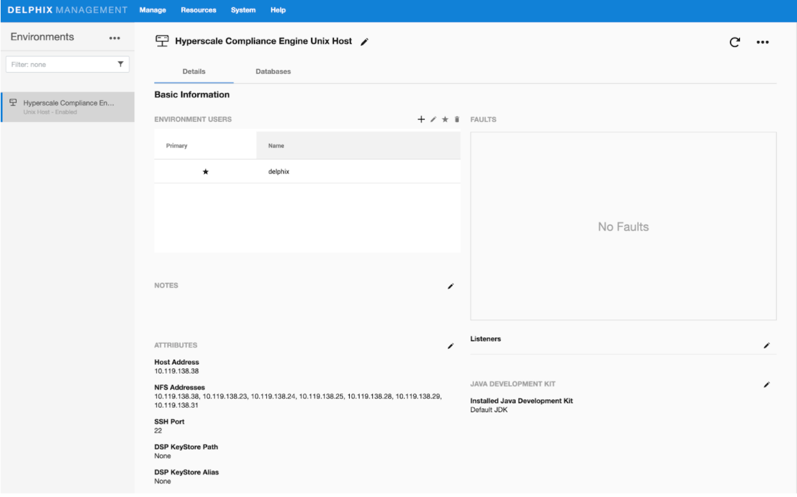

# NFS Server Installation

The Hyperscale Compliance engine requires a Staging Area to read from the source file(s) and write to the target file(s). The Staging Area must be an NFS shared filesystem accessible to the Hyperscale Compliance engine and the masking engines. The following are the supported ways by which the filesystem can be shared over NFS(NFSv3/NFSv4):

## Delphix Virtualization Engine Empty VDB

To create a Delphix Virtualization Engine empty VDB, follow the below procedure.

### Virtualization Engine Installation​

Delphix Virtualization Engine is a data management platform that provides the ability to securely copy and share datasets. Using virtualization, you will ingest your data sources and create virtual data copies, which are full read-write capable database instances that use a small fraction of the resources a normal database copy would require.

For information about installing the Virtualization Engine, see [Virtualization Engine Installation](https://docs.delphix.com/docs/deployment) documentation.

### Discover and Configure Hyperscale Compliance Engine’s Environment

1. After installing and configuring the Virtualization Engine, make sure that the [Network and Connectivity Requirements](https://docs.delphix.com/docs/datasets/unstructured-files-and-app-data/unstructured-files-environment-requirements/unstructured-files-on-unix-environments/network-and-connectivity-requirements-for-unix-environments) for using Empty VDB on Unix environments are met.
2. Discover the Hyperscale Compliance engine’s Unix host on the Virtulization’s Engine Management application. For more information, see [Adding a Unix Environment](https://docs.delphix.com/docs/datasets/unstructured-files-and-app-data/unstructured-files-environment-requirements/unstructured-files-on-unix-environments/adding-a-unix-environment).
3. Navigate to **Manage > Environments** to view the discovered Hyperscale Compliance engine’s Unix host.
4. After the discovery is completed, configure the same Unix host on the Environments screen such that the IP addresses of the Hyperscale Compliance engine’s Unix host along with the masking engines part of the Masking Engine cluster are populated in the NFS Addresses field.

    This is done to ensure that the empty VDB is shared with both Hyperscale Compliance engine and the masking engines part of the Masking Engine cluster.

    

### Provision an Empty VDB

1. Follow the steps listed under [Create an Empty VDB for Unstructured Files in the Delphix Engine](https://docs.delphix.com/docs/datasets/unstructured-files-and-app-data/create-an-empty-vdb-for-unstructured-files-in-the-delphix-engine) to provision an empty VDB on the discovered Hyperscale Compliance engine’s Unix host.
2. Note the mount path provided while provisioning the empty VDB as that is the path which will be used to fill the empty VDB with the source file(s) that the Hyperscale Compliance engine needs to mask and where the target masked file(s) will be placed.

    !!! note
        Hyperscale Compliance OS user should have read/write permissions on the mount point path where the empty VDB will be provisioned.

    The location of the mounted empty VDB on the Hyperscale Compliance engine’s Unix host can be found with a simple ‘grep’ of the mount path, provided while provisioning the empty VDB, using the ‘mount’ utility:

    `hyperscale-engine:~$ df -h | grep /mnt/provision/hyperscale_data 10.119.138.34:/domain0/group-2/appdata_container-3/appdata_timeflow-4/datafile 20T 3.5T 16T 18% /mnt/provision/hyperscale_data`

3. Copy the source file(s) to the location where the empty VDB has been mounted.

## NFS File Server

1. An NFS shared filesystem can also be provided by a typical NFS server. Export a filesystem from the NFS file server such that the Hyperscale Compliance Engine and Masking Engines part of the Masking Engine Cluster have read and write permission on it. As such, the export entry should be of the following form based on the UID/GID corresponding to the owner of the shared path:

    ``<mount_path> <ip1,ip2,ip3,ipn>(rw,all_squash,anonuid=<uid>,anongid=<gid>)``

2. Export the NFS share using the below command:

    `sudo exportfs -rav`

3. Once the NFS share is exported from the NFS server, proceed to mount the same share on the Hyperscale Compliance Engine host:

    ```
    sudo mount -t nfs -o vers=4 <nfs-server-host-ip>:<mount_path>
    <user.home>/hyperscale/mount-dir
    ```

## Storage Requirements for the NFS File Server

Considering a single Hyperscale Compliance job execution, the Hyperscale Compliance Engine will create split files from the source file(s) and the target masked files. As such, the required storage will amount to 3X the size of the source file(s).
If the **File Merging** is enabled as part of the Hyperscale Compliance job execution, then the required storage will amount to 4X the size of the source file(s).
