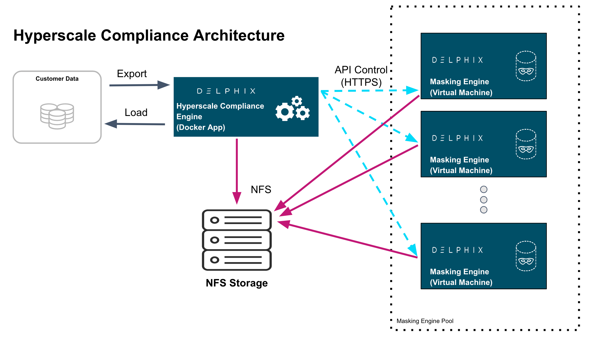

# Overview

Hyperscale Compliance is an API-based interface that is designed to enhance the performance of masking large datasets. It allows you to achieve faster masking results using the existing Delphix Masking offering without adding the complexity of configuring multiple jobs.
Hyperscale Compliance first breaks the large and complex datasets into numerous modules and then orchestrates the masking jobs across multiple masking engines. In general, datasets larger than 1 TB in size will see improved masking performance when run on the Hyperscale architecture.

## The Masking Platform
Delphix Masking is a multi-user, browser-based web application that provides complete, secure, and scalable software for your sensitive data discovery, masking, and tokenization needs while meeting enterprise-class infrastructure requirements. To read further about masking features and architecture, read the [Masking Documentation](https://maskingdocs.delphix.com/).

## Hyperscale Compliance Architecture​

For achieving faster masking results, Hyperscale Compliance uses bulk import or export utilities of data sources. Using these utilities, it exports the data into delimited files. Hyperscale Compliance engine then splits the exported data into multiple modules of smaller chunks and configures the masking jobs of all the respective chunks across multiple masking engines. Upon successful completion of the masking jobs, the masked data is imported back into the database.

### Hyperscale Compliance Components

The Hyperscale Compliance architecture consists of four components mainly; the Hyperscale Compliance Engine, Source/Target Connectors, the Masking Engine Cluster, and the Staging Server.

#### Hyperscale Compliance Engine

The Hyperscale Compliance Engine is responsible for horizontally scaling the masking process. It does so by taking a series of files (provided by a source connector) and initiating multiple parallel masking jobs across nodes in the masking engine cluster. Depending on the number of nodes in the cluster, you can increase or decrease the total throughput of an individual masking job.
Currently, the Hyperscale Compliance Engine supports the following two strategies to distribute the masking jobs across nodes available :

- **Intelligent Load Balancing**: This strategy considers each masking engine’s current capacity before assigning any masking jobs to the node masking engines. It calculates the capacity using available resources on node masking engines and already running masking jobs on the engines.
- **Round Robin Load Balancing**: This strategy simply distributes the masking jobs to all the node masking engines using the round robin algorithm.

#### Source and Target Connectors​

The Source Connectors are responsible for unloading data from the system of record (SOR) into a series of files located in the staging area. These connectors leverage bulk unload operations offered by the SOR and are therefore unique to each other. The prerequisites for running each connector vary slightly, but always require network access to the SOR from the host running the connector and credentials to run the appropriate unload commands.

!!! note
    Source/Target Connectors are not part of the current Hyperscale Compliance solution and are out of scope for the current release. They will be part of an upcoming release. You are advised to contact your respective Account Managers to discuss Delphix building the connectors required for your respective use case.

#### Staging Area

The Staging Area is where data from the SOR is written to a series of files by the Source Connector. It can be a file system that supports NFS protocol. The file system can be attached volumes, or it can be supplied via the Delphix Virtualization Engine vFile feature. In either case, there must be enough storage available to hold the dataset in an uncompressed format.

#### Masking Engine Cluster

The Masking Engine Cluster is a group of Delphix Masking engines (version 6.0.7 and later) leveraged by the Hyperscale Compliance Engine to run large masking jobs in parallel. For installing and configuring the Masking engine procedures, see [Masking Documentation](https://maskingdocs.delphix.com/).

## Next Steps

* Read about [Installing Hyperscale Compliance tar](./Getting_Started/Hyperscale_Compliance_Installation.md).
* Read about the [Network Requirements of the Hyperscale Compliance](./Getting_Started//Network_Requirements.md).
* Read about [Accessing the Hyperscale Compliance APIs](./Getting_Started/Accessing_the_Hyperscale_Compliance_API.md).
